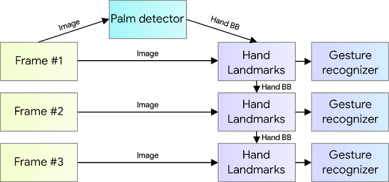

# Hand_Gesture_Drone

As the title suggests, we are trying to build a hand-gesture controlled drone, where you don't need to have the transmitter in your hand to fly it.

We have divided our project into three modules:

    1. Preparing a Drone Simulation environment.
    2. Connecting gesture recognition and Drone motion control api.
    3. Building python script for gesture recognition.    

- ## Preparing a Drone Simulation environment.
    While searching for simulators we came across many of them such as webots, gazebo, coppeliasim.

    For our purpose we have come to use Coppeliasim due to following reasons.

    -	It is based on a distributed control architecture: each object/model can be individually controlled via an embedded script, a plugin, a ROS, a remote API client, or a custom solution.
    - 	Its compatibility with both Windows and linux.
    - 	Multiple language support for controller.
    - 	Fast and lightweight.
    -	Small size and ease of installation.
    -	Its large support base and proper documentation.

    

    To visit the site [click here](https://www.coppeliarobotics.com/)

- ## Connecting gesture recognition and Drone motion control api.

    To setup CoppeliaSim api client one just have to copy the files given in "remoteAPIsetting" folder in the same folder where all other scripts are.
    
    If making your own scene then one  have to paste "simRemoteApi.start(19999)" in any of the node in coppeliasim environment to start the api connection.    

                
    We have also provided the motion controlling module named as "motion.py" in the folder "Drone_command" . It send the desired motion calls to api server for the motion of drone in simulator.
    
    motion commands can be easily understood by seeing the "motion.py" file code.

- ## Building python script for gesture recognition.
    For gesture recognition we have used mediapipe's hand tracking solution.

    
    
    Mediapipe offers cross-platform, customizable ML solutions for live and streaming media.

    While coming naturally to people, robust real-time hand perception is a decidedly challenging computer vision task, as hands often occlude themselves or each other (e.g., finger/palm occlusions and handshakes) and lack high contrast patterns.

    MediaPipe Hands is a high-fidelity hand and finger tracking solution. It employs machine learning (ML) to infer 21 3D landmarks of a hand from just a single frame.
 
    Whereas current state-of-the-art approaches rely primarily on powerful desktop environments for inference, this method achieves real-time performance on a mobile phone, and even scales to multiple hands. 

    MediaPipe Hands utilizes an ML pipeline consisting of multiple models working together: A palm detection model that operates on the full image and returns an oriented hand bounding box. A hand landmark model that operates on the cropped image region defined by the palm detector and returns high-fidelity 3D hand keypoints.

    
    
     
    
    #### Detected hand landmarks
    

            
## Working demo

To see working demo of our implementation [click here](https://youtu.be/G5uDVJVV_ik) 
    
    

    
